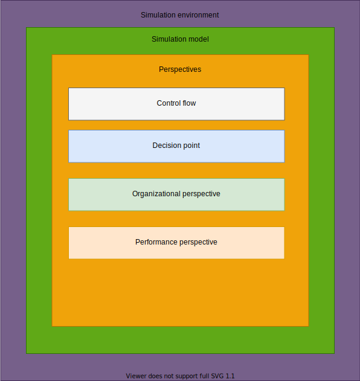
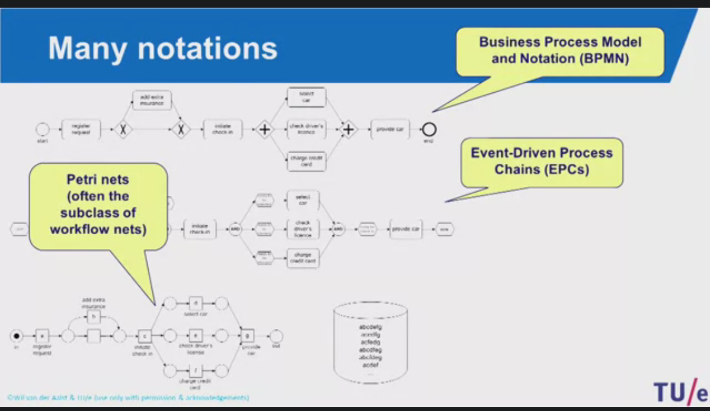
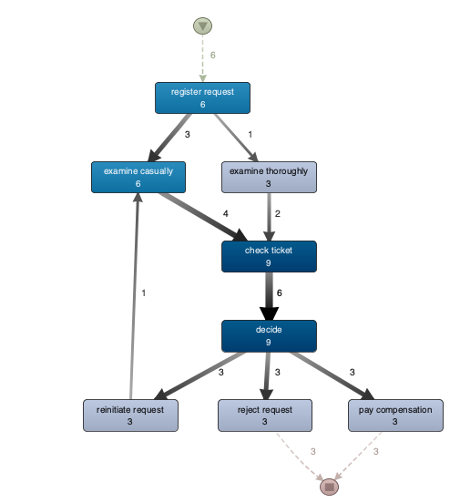
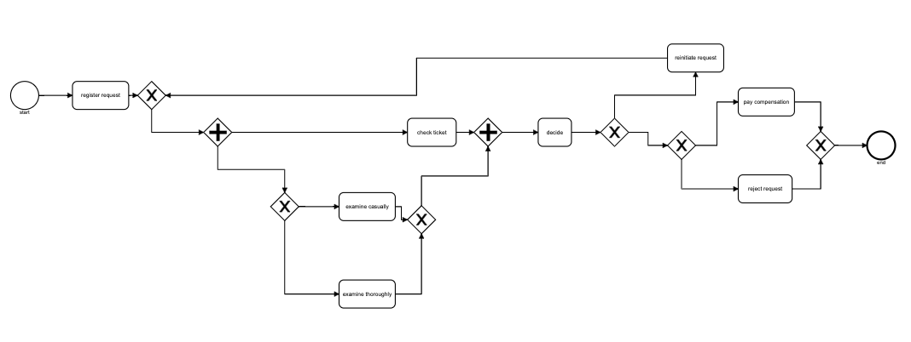
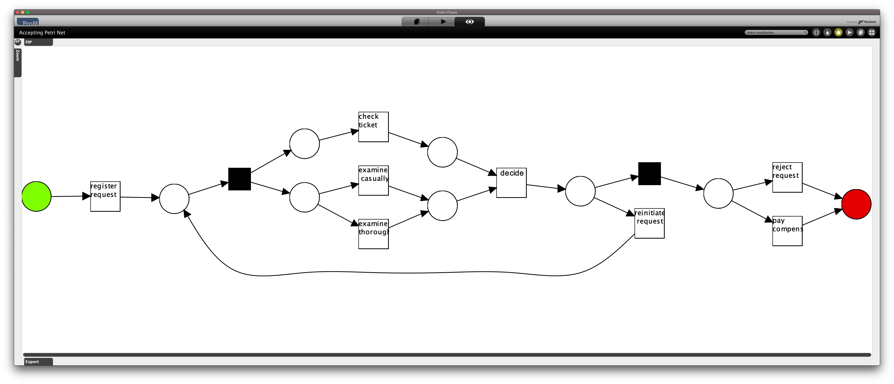
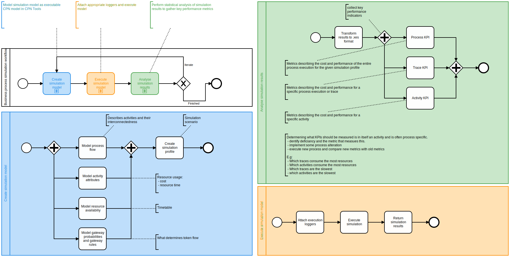

# readme
Repo containing the docker-compose file and brief project description.

## Run, presuming docker-compose.yml is in cwd
``` shell
docker-compose up
```

## Project aim
Create a proof of concept implementation that uses process mining and business process simuation to perform process enhancement. This is made possible by first discovering a business process model from event data and then enhancing this model with data from additional *perspectives*. Each of these perspectives represent a process mining viewpoint. The culmination of *mined* data is then integrated into a single executable model.Business process simulation allows for the creation of synthetic event logs which can the be analysed to gather metrics about process performance. The simulation model can the be altered to test specific simulation scenarios or alternative process models.

We are specifically interested in gathering metrics on throughput times, resource utilization and process cost. The overarching goal being to increase efficiencies. This implies better resoruce utilization, lower costs, and lower throughput times. 

By use of business process similation we will be able to answer *what if* questions, such as:
 - What happens if we add or remove resources
 - Where are our current bottlenecks
 - How does the process handle a designed input scenario


It is important that the simulation model remains true to the underlying process. This is often a critique of experiments that do not start from an existing event log. Simulation models created from a subjective understanding of the *ideal* process can often be misrepresentative of reality. Running simulations on a process that is not true to the *actual* process can yield incorrect results.There is often a clear distinction between the modeled process and the "real" process. Process mining allows us to discover the "real" process model by analysing event data. However, it should be noted that the discovered model is only representative of its input, meaning that any behaviour that is not represented in the event log will not be discovered. Having extensive event logs is therefore a benefit. 

Business process simulation builds directly on the strong fundamentals of discrete event simulation as the resulting simulation model is in essence run on a discrete event simulation engine. While there are many different vendors and tools that offer simulation engines designed for simulating business processes, the open source community does not have a tool with comparable maturity. This problem is partly being addressed in this project by creating a wrapper for the *scylla* business process simulator that takes a bpSIM 2.0 specification as input and produces a *synthetic log* as output. This is then wrapped in a http server and offered as a docker container.

I argue that having complete transparency is especially imporant when performing business process simulation due to the poor semantics of BPMN. This requires that the process model is translated into a format that is executable. 

Simulating business processes is especially difficult due to a series of problems, the core issue being the lack of formal verification BPMN. There are other business process modeling notations which have well declared semantics and can therefore be formally verified, however these do not have the same adoption.


## Current issues that i am researching and resolving can be seen on the issue tracker  

## Related works

Works that describe how one can perform model enhancement through simulation and works that detail the different process mining perspectives.
### Simulation and enhancement

1. [Discovering simulation models](https://www.sciencedirect.com/science/article/abs/pii/S0306437908000690)  
> Novel work on how to create simulation models from process logs. Uses CPN Tools to run simulation. 

2. [Design of an Extensible BPMN Process Simulator](https://www.researchgate.net/publication/322524759_Design_of_an_Extensible_BPMN_Process_Simulator)

3. An extentisible BPMN Process Simulator, Master thesis by Tsun Yin Wong. (Not publically distributed)  
> Describes the implementation of the [Scylla project](https://github.com/bptlab/scylla). Allows for simulation of exensible BPMN models.  
> Can be understood as the technical report of [2]

2. [Automated discovery of business process simulation models from event logs](https://www.sciencedirect.com/science/article/pii/S0167923620300397?via%3Dihub)
> Similar approach to "Discovering simulation models"

4. [Petra: A tool for analysing a process family](https://www.researchgate.net/publication/288818349_Petra_A_tool_for_analysing_a_process_family)
> Describes how one can locate a common process model, provided a series of similar models that all describe very similar processes. In essence just brute force simulation. Create numerous variations and simulate all of them, then compare results to find the best match.
> 
### Perspectives
**Decision point analysis**  
5. [Decision Mining in Business Processes](http://bpmcenter.org/wp-content/uploads/reports/2006/BPM-06-10.pdf)  
> Novel work on decision point analysis

**Control flow**  
6. [Automated Discovery of Process Models from Event Logs: Review and Benchmark](https://ieeexplore.ieee.org/document/8368306/)
> Novel work on performing benchmarks on different process discovery algorithms

### Overview of current simulation tools
7. [Process Simulation Support in BPM Tools: The Case of BPMN](https://core.ac.uk/download/pdf/55638662.pdf)
8. [Business Process Simulation - A Tool Survey](https://citeseerx.ist.psu.edu/viewdoc/download?doi=10.1.1.87.8291&rep=rep1&type=pdf)

9. Discrete-Event Simulation and System Dynamics for Management Decision Making by Sally Brailsford, Leonid Churilov, and Brian Dangerfield 

10. Comparison of discrete event simulation tools in an academic environment

## Concepts
The functionality offerent by the services tie into the concepts and aims that we wish to fulfill. 
### Mining different perspectives
The simulation model can be understood as a executable model that is comprised of a series of different perspectives. In essence a layered cake.



### Novelty
Wile there have been several works that have addressed process enhancement through simulation, such as *discovering simulation models, Petra, and An extentisible BPMN Process Simulator* these are lacking details of how one should combine the different perspectives to crate the resulting execution model.

There are two approaches to this problem. 
1. Combining perspectives into a single wholistic model, and then translating this into the executable model that is run in the simulation engine or application.
2. Combining the perspectives into a single wholistic model which by itself is executable. Thus removing the need to create a function that maps the wholistic model to the executable format.

The first approach requires that the user has a very good understanding of not only the formalism that the wholistic model is represented in, but also the resulting executionable model. There are several works that go this route. [1, 4] combine all discovered perspectives into a wholistic model represented as a process-tree and then transform this into a colored petri-net model which can be executed in CPN-Tools. While both works have produced valid results, they do a poor job of explicitly describing how the perspectives are combined and more importantly how the wholistic model is transformed into the executable model. 

I will address this discrepancy by explicitly describing and documenting how these perspectives are combined into a single wholistic model, and then how this model can be executed. However, i will employ the latter approach and combine perspectives directly onto a executable BPMN model. Not only is the BPMN model easier to understand, but this also makes it easier to comprehend exactly where the information from the different perspectives is being mapped to. 

There are currently no open source process mining tools that allow for simulation of BPMN models. See https://www.processmining-software.com/resources/ for an overview of existing process mining software.


## Fundamentals
Business process simulation by Kerim Tumay is a novel work that covers many of the fundamentals of simulating business processes specifically.

Business process simulation provides you witht the *ability to visualize how a process would behave, measure its performance, and try “what ifs” in a computer model for tool an invaluable makes computer simulation decision making.* Such a simulation model realistically captures *resource constraints, decision rules, and stochastic behavior of real-world situations.* The model is able to quickly jump from one event to the next in compressed time. The model output (synthetic log) can then be evaulated.

A simulation model is comprised of a series of basic components. These may differ in naming and functionality depending on the vendor, but in essence they are the same. These are basic model building blocks, activity modeling constructs, and advanced modeling elements. 

**Basic model building blocks**  
1. entities
   1. also known as flow objects, tokens, or transactions. These may have additional attributes such as quantity, priority, and due date.
2. resources
   1. agents that add value to entities. Examples are human case workers, machinery, equipment. Resources are allocated to activities and may have attributes such as cost and expertise.
3. activities 
   1. linked by connectors to represent the flow of entities through the model. Activities may or may not add additional values.
4. connectors
   1. used for linking processes and activities
   2. entities follow these connections 

**Activity modeling constructs**  
A minimum set are required for modeling the dynamic behaviour of business processes.  
1. generate
   1. generated the arrival of entities into the model
   2. the arrival may be
      1. random
      2. deterministic
      3. conditionaø
   3. examples may be the arrival of patients at a clinic
   4. the activity may hold values for arrival time, quantity, frequency and occurance
2. branch
   1. allows for defining alternative routings for entities
   2. this branching may be based on a probability of a conditional
3. assemble
   1. assembles multiple entities coming from multiple sources to create a single entitiy.
4. batch
   1. combines a given number of entities into a single batch activity
   2. for example the delivery of mail
5. gate
   1. holds entities in queue until a signal is received
   2. could for example be used to model orders held in inventory until a signal is received
6. split
   1. takes an incoming entity and created children of that entity as well as providing an output of the parent entity
   2. for example, creating copies of a purchase order and sending it to two different departments
7. join
   1. takes the children and parent entities that were split and mathes them to produce the original one
   2. could for example be used to match paperwork with a shipment


**Advanced modeling functions**  
Used in the event where one needs more advanved modeling functions that provide the power and complexity to model real world business processes.
1. Attributes
   1. logical value that can be used for decision making or performance tracking
   2. for example the capacity or trigger level for an actiivty 
   3. attributes can be used to describe time and cost
2. expressions
   1. used to defined complex decisions or resource assignment rules
   2. such as IF THEN ELSE, INCREMENT and DECREMENT 
   3. provide the flexibility to model unique realw world situations
3. Resource schedules
   1. activities are constrained to the availability of resources
   2. the resource beign the executing agent that permits and performs the activity or work
   3. resource schedules are used to model this varying availability. Assuming that all resources are constantly available is unrealistic
   4. these schedules can be used to model when resources are on or off shift, and perhaps even more complex schedules 
4. Interruptions
   1. most processes experience interruptions that are planned or unplanned
   2. these may be stochastic
5. User defined distributions and functions
   1. may be used for represnting the variability associated with arrival times, activity times, or move times. Distributions may be discrete or continuous

**Performance metrics**  
1. Cycle count
   1. total time an entity spends traversing the process
   2. included value-added process time, waiting time, movement time, etc.
   3. may also be described as throughput time
2. Entity count
   2. sum of entities processed plus the entities that are currently in process
3. Resource utilization
   1. defines the percentage of time that a resource spends in each state (busy, not busy, and more)
4. Activity Cost
   1. resources are defined by the number of available units, usage, cost, setup costs, and fixed costs. When an activity is defined, it is defined by the resources required to perform it, the duration of the activity, and the entities that it processes. 

It is also important to mention that there is no definite way of correctly simulating a particular business process. Depending on the nature of the underlying process and business context we whould make intelligent choises in regards to how the simulation should be divided, modeled, and executed. For example, the modeling and simulation of a factory existing of automated machienery that runs continuously both day and night will have different requirements to that of a hospital which mostly revolves around human agents. Humand are far less predicatble then programmed robots and a hospital environment is very different from that of a automated factory.

See section 4 in Business process simulation (Tumay, Kerim) for details on what considerations one should take.

**Side note: full cirle**  
Keen readers might recognize that many of these constructs overlap greatly with constructs from Object Oriented Programming (OOP). This overlap is not coincidental, because these constructs originate from Simula, the simulation language written by Kristen Nygaard and Ole-Johan Dahl in the early 1960s to simulate discrete event systems. 


### Discrete Event Simulation
Method for simulating behaviour and performance of real-life processes, facilities, or systems. Models queues as they progress through time. The simulated world is represented as a network of queues and activities in which entities or object flow through. Resources are assigned and shared in-between activities. The fundamental building blocks of DES systems are:
1. Entities or objects
   1. items that flow through the system
   2. described by use of attributes
      1. e.g.: type, dimensions, weight, priority, order number, color, etc.
      2. These attribute can be used in influence system logic. E.g., assigned priority influences its ordering in a waiting queue.
2. queues
   1. areas where entitites wait to be worked on
3. activities
   1. areas where works is being performed on entities
4. resources
   1. required to be present to operate activities

Two other important concepts are time-handling and random sampling.

Time progression can be modeled by use of a constant time step. This is often used when modeling continuous systems or phenomena such as fluid dynamics. There is however a  caveat, and that is that computers are not able to model continuous change in the true sense of the word, but rather discrete change in very small increments and thus giving the approximation of a continuous system. The big trade of being that the smaller the time incremenet the longer the execution time will be. However, small increments are needed for high accuracy. On the other hand we have discrete event simulation which focuses on the modeling of entities as they flow through a system, and is therefore not bound to a certain fixed interval. Approching such a systme with the continuous approach would lead to poor efficiency and lots of overhead provided that there would be many datapoints that contain no new information. 

It is only when an activity has finished that the system state is updated. Typical events are an entity arries, an activity starts adn an activity ends. 

A key and central element of most DES models is the need to represent randomness. This could occur in the length of time an activity takaes, the arrival rate of customers, entity attributes, or the route an entity will take through a system. While these values are stochastic we migh know an accurate distribution. For example, we might know that an activity takes between 5 and 10 minues, but we cannot accurately predict what the exact service time should be for a specific entity. In addition to knowing the range of some variable, we might also look at additional data to gather realistic frequencies. This will allow us to assign weights to more frequent occurances and thus get a more accurate stochastic distribution. 

Generating random numbers accurately is more complex than simply generating a fitting value. Random numbers can be described by two properties: 
1. uniformity - all values have the same probability
2. indepedence - once the value has been chosen, it does not affect its probability of being chosen again

Once we have created a set of random numbers we can use these to sample a distribution. This is accomplished by relating the right number of random numbers to each outcome in order to ensure that the outcome has the right probability of happening. For example if we have a split leading to two activities, purchase or not purchease. Where the former has a probability of 30 and the latter the probability of 70 then we can simply assign 30 and 70 percent of our generated numbers to its respective outcome. In practice this is very simple. For the activity with a 30% probability we can assign a range from 0.00 to 0.30 and for the activity with a 70% probability we can assign a range from 0.30 to 1.00. It is important that the numeber is read according to the ranges outer limits. For the 30% activity this would imply that the random number be greater than or equal to 0.00 whilst also being less than 0.30, more accurately described as 0.00<= *number* < 0.30. 

While all numbers might noe be represented in the generated distribution, it still holds true provided that if we were to scale the size of the distribution to thousands of digits then the percentage of times each number occurs would be close to 1% each. 

### Discrete event simulation and Business process simulation
DES can be used to simualte a wide assortment of systems such as distributed databases, network routers and switches, IP networks, bluetooth networks, a vehicle production line, patient admittance at a hospital, complex queueing sytems, and much more. Provided that DES is able to accurately simulate such a wide collection of diffrent sytems makes it safe to assume that the modeling language and constructs have to be fairly basic in order to capture all of this behaviour. A interesting obervation is also that despite the examples spanning industries and domains is that they are at their core very similar. This is a strengt in that DES has high applicability, but also a weakness in that it is not a very effective or understandable technique for modeling certain systems and processes. One such example are business processes.

Such business processes can be used to strictly govern the permitted behaviour but can also be used as actual executable models in other systems. Modern examples include the structuring of complex infrasructures and other IT operations. Explicit examples can be drawn from the intersection of IT and finance, where these model are used to design actual system implementations. BPMN has become for many become the defacto modeling notation for describing business processes, and with good reason. It is therefore not without fault that we would like to use BPMN as a executable simulation model in DES. Describing complex business processes directly in some formal DES languate can quickly become very complicated and required a good understanding of the DES language itself. Examples can be drawn from the use of colored petri-nets for the modelign and execution of BPS. There have been many works that have tried to address the problem of translating a BPMN model to some executable simulaton model, but as we will see this direct mapping is simply not possible because the simulation model requires additional information that the BPMN model simply does not posess.

[7] does a good job of describing what the shortcoming of BPMN are and further describes some of the efforts that have been made to try and address this.  


**Upsides**
Notation that has wide adoption, is easy to use, easy to understand, easy to add or remove elements to the process. 
**Downsides**
BPMN was strictly created to be used as a modeling notation and was therefore not designed with formalisms or executability in mind. This leaves much to be desired and required that the adopted standard be extended with custom concepts. These concepts can pertain to its execution in some process management system, but also apply to simulation. For example: 
1. BPMN does not have any concept for queues.
2.  It is not possible to assign a priority to a token. 
3.  Once the activity has started another activity cannot pre-empt the activity
4.  Not possible to assign inner-task times
5.  Not possible to assign probabilities to branches
6.  Not possible to specify routing policies

Despite all of these shortcomings there have been many attempts to rectify these disadvantages or *bridge the gap*. For example:
1. converting simple BPMN event into elements that have the desired properties, as described in DES. This includes begin and end events, 


### DES input formats


#### BPMN 
{some comments about the popularity of BPMN}

The mined process model is converted from a process-tree to a BPMN model. The benefit of BPMN being that it is widely accepted as the defacto modeling language for business processes and therefore has wide adoption. While useful and well proven as a tool for modeling, it leaves much to be desired when using it as a executable model due to its lacking formalism. This is likely much of the reasoning for why it has had poor adoption as a executable model in BPS. There are works that address this discrepancy by transforming it into a executable model in a different formalism whilst also adding additional attributes and information that was is not natively permitted in BPMN. There are also BPMN extension specifications that address this exact discrepancy, such as the Business Process Simulation Specification. 

This project will use BPMN as the notation for representing 


#### BPMN as a DES model
At first glance one might be tempted to assume that BPMN is suitable for use as a executable CPN model, but this is not the case.
1. DES is heavily depdendent on queues. BPMN has no concept of a queue
2. BPMN has no provisioning of assigning priorities to tokens
3. BPMN as no provisioning of probabilities to branches
4. BPMN has no way of specifying routing policies

Despite these shortcomings, there have been multiple advances that try to bridge this gap. 
write about bpsim spec
write about bridging the gap section
BPMN to CPN 

<find work where bpmn model was transalted on cpn using hierarchical models>


#### DES models
Discrete event systems can be modeled by use of many different specifications. The employed model is dependent on the underlying simulation engine and the input that it expects, but also bound to the aforementioned DES concepts. Concepts such as resource modeling, activity modeling, queues, etc. 

In process mining there have been many works that detail the mining of process models which are then subsequently executed in related simulation tools. The most common combination being to use colored petri-nets and CPN tools. Colored petri-nets differ from traditional petri-nets in that they allow for the assignment of attributes to tokens. This overlaps with entitiy attributes in DES. 

While CPN and CPN-tools is a well documented and proven combination i argue that it is far from ideal. [1, 4] are examples of works that employ this method. Here they perform different process mining operations to gather data pertaining to four perspectives. These perspectives and how they relate to explicit concepts within DES will be detailed in a subsequent section. While these works have sound results, they are lacking in explicit details regarding how the different perspecives are merged. They offer their own java implementations in the ProM process mining tool but offer no details as to how the conversion is being performed. Representing business processes as CPN models is far from ideal as these are not only complex and difficult to read but have very little adoption outside academia. While a great simulation tool it is not ideal for the task at hand. 

BPMN is the defacto modeling notation for representing business processes and has reach world wide adoption. While easy to understand it suffers from poor semantics. BPMN was never designed to be used in combination with formal methods and therefore has serious flaws. 

 

 


Why use bpmn
issues of using bpmn as a simulation model format
list reasoning stated in the simulation master thesis

#### Integrating perspectives into executable BPMN model

#### Control flow perspecive
This can be understood as the base layer. Here we discover a process model from the event log. This can be represneted in different formats, such as petri-net, process tree, BPMN model, etc. While these representations are vastly different, they encode the same information. The benefit of petri-nets being its formalism, and the benefit of BPMN that its easy to understand. 

The discovered model is in essence just a series of nodes and arcs. The model specicically encode how these relate to each other and therefore the process *flow*. Specifically, we have places, transitions, arcs. In the event where transitions have multiple incoming out outgoing arcs then these are called splits. 

The process model is first mined by use of the inductive miner. While there are many diferent mining algorithms, such as the alpha miner and heuristic miner, the inductive miner has been proven superior. 

There have been written works that cover the upsides and downsides of different mining algorithms. See [this work](https://ieeexplore.ieee.org/document/8368306/). While there is no single algorithms that is perfect for every usecase, the inductive miner was choosen because of the quality of its resulting model (see section of qulity dimensions) and also because it guarantees soundness.


*The results of the empirical evaluation show that methods that seek to produce block-structured process models (Inductive Miner and Evolutionary Tree Miner) achieve the best performance in terms of fitness or precision, and com- plexity.*

There are three variants of the inductive miner. The base verison is used in this project, while there exists version that are tailored to handling incomplete traces and infrequent behavior. The aformentioned work is suggested for further reading.
##### Soundness, log-model evaluation, and model representations
The quality of a model is ensured by calculating metrics on the four quality dimension. A sound model must meet the following criteria: 
1. safeness: places cannot hold multiple tokens at the same time
2. proper completion: if the sink place is marked, all other places are empty
3. option to complete: it is always possible to reach the sink place
4. absence of dead pars: for any transition there is a firing sequence enabling it

A model can be valid whilst not sound, it is therefore important to mark this distinction. Soundness strictly govered by the accompanying traces. Proved that the inductive miner guarantees a sound process model, this does not have to be checked. However, we can collect metrics on the four quality dimensios to further quantify how well the mined process model describes its traces. Here we a score ranging form 0 to 1 on the following dimensions:   
1. replay fitness
   1. The higher the fitness the more of the traces in the log the model can account for. Perfect fitness can account fro all traces in the event log
2. precison
   1. a model is precise if it does not allow for too much behaviour. It would likely be possible to construct a simple petri net that had great fitness and is very simple, but this would have terrible precision as it would in essence allow for too much behaviour. A model that is not precise is underfitting, which is when the model over-generalizes the example behaviour in the log, i.e allows for behaviour that are very different from those present in the log
3. generalization
   1. A model should generalize and not just be limited to the behaviour seen in the log. A model that does not generalize is overfitting, which is the problem that occurs when the model is tailored to the behaviour seen in the log, when it is obvious that this is just example behaviour
4. simplicity
   1. With high fitness often comes high complexity, which is naturally unwanted. The simplest model that can explain the behaviour seen in the log is the best model, i.e Occams razor


Process models can be represented using a series of different process modelling languages. While there are many languages and some serve specific functions better than others, they are all based on the same concepts and therefore very similar. 


> screengrap taken from https://www.coursera.org/lecture/process-mining/2-5-workflow-nets-and-soundness-tBnqo

The representations look different, but they all try to express the same phenomena and in the end they all generate traces of events. 

#### Decision point 
This perspectives is concerned with discovering the different data dependencies that influence the routing of a case and then subsequently the underlying decision rule that determines the routing of a case. Every decision point can be understood as a classification problem where the classes are the different decisions that can be made. All attributes and datapoints logged before this decision point may contribute in the classification.

The log contains no explicit information about which decision was made at a decision point for some process instance. This information has to be infered. 

More about [Decision mining here](http://bpmcenter.org/wp-content/uploads/reports/2006/BPM-06-10.pdf)

#### Performance analysis
Here gather information about execution times, waiting times, decision point probabilities, case generation scheme.  

The execution times is the time between activity start and end.   

The waiting time is the time between the point at which the last activity that is a direct predecessor of this activity was completed and teh moment at which the execution of the activity itself is started. In essence the time spent in queue. However, queues imply that the following activity be started immediately. The waiting time can be composed of queue time, but also other factors. 

Extracting execution time and waiting time is trivial, as the start and complete events have timestamps.

For every decision point we can derive probabilities of alternative paths based on how often each path was followed during replay.

The arrival rate can be derived by looking at the start times of the first activity in each trace.

Additional statistics can be collected during replay to determine how many cases arrive at the process per time unit. It is often assumed that the traces follow a normal distribution, however this might not always be the case.

why collect probabilities for on decision point?
- can be used as a neat metric
- can also be used to set decision point instead of rule
why collect distribution?
 - to collect execution and waiting times relative to the distribution
 - higher intensity would cause higher execution times


#### Role discovery
Involves organizational mining. Aims at discovering both the organizational model and assignment rules. Possible to derive resource groups in which the people execute similar activities. 

## Services
### GUI

### Discovery
Process mining service built on Flask and PM4PY. Warps some needed functinoality such as control flow discovery, role discovery, model transoformation, etc.
Please see the swagger.yaml file in the repo for available endpoints.
1. #### /doc
   1. for rendering the swagger documentation in swagger UI
2. #### /discover
   1. for discovering process model from .xes log
   2. uses the inductive miner to produce process tree
3. #### /translate
   1. for translating process tree to BPMN 2.0 model
4. #### /evaluate
   1. for performing model quality assessment. Supports the following:
      1. **Replay Fitness**  
         1. **Token-based replay**  
         ( Berti, Alessandro, and Wil MP van der Aalst. "Reviving Token-based Replay: Increasing Speed While Improving Diagnostics." ATAED@ Petri Nets/ACSD. 2019. )
         1. **Alignment-based replay**  
         **need to locate source on this**
      2. **Precision**         
         1. **ETConformance**   
         (Muñoz-Gama, Jorge, and Josep Carmona. "A fresh look at precision in process conformance." International Conference on Business Process Management. Springer, Berlin, Heidelberg, 2010)
         1. **Align-ETConformance**  
         (Adriansyah, Arya, et al. "Measuring precision of modeled behavior." Information systems and e-Business Management 13.1 (2015): 37-67.)
      1. **Generalization**           
      (Buijs, Joos CAM, Boudewijn F. van Dongen, and Wil MP van der Aalst. "Quality dimensions in process discovery: The importance of fitness, precision, generalization and simplicity." International Journal of Cooperative Information Systems 23.01 (2014): 1440001. )
      1. **Simplicity**         
      ( Blum, Fabian Rojas. Metrics in process discovery. Technical Report TR/DCC-2015-6, Computer Science Department, University of Chile, 2015. )
5. #### /rolediscovery
   1. For discovering role. A role can be understood as a set of activities that are executed by  a similar (multi)set of resources. 
   2. Can help with understanding which activities are executed by what roles
   3. Initiallye each activity is related to a unique role. After discovering the roles we can merge similar roles and create a set that is more representative of the actual roles.
   4. Article: Burattin, Andrea, Alessandro Sperduti, and Marco Veluscek. “Business models enhancement through discovery of roles.” 2013 IEEE Symposium on Computational Intelligence and Data Mining (CIDM). IEEE, 2013. 
6.  ##### /decisonpointdiscovery
    1.  For performing decision mining. Used to retrieve the features of the cases that go in the different directions. Allows for calculating a decision tree that explains the decisions. 
    2.  Performed by specifying waht decision poin to mine for. Then we get back a dataframe with the features of all traces that followed a specific branch. 
7.  #### /performanceanalysis


## On the issue of formal verification versus simulation based verification
Simulation based verification versus formal verification. 

To what extent is it required that our business process can be formally verified.

In formal verification we define properties and then use model checking techniques to try and genereate any set of possible inputs that breaks the conformance of these properties. We essentially find all possible input and test if any of these break our condition. 
In simulation we define a specific subset of inputs and then tests wheter our properties hold for these inputs. The input space if naturally far smaller then that of the formal verification, but they also serve two different purposes.

Formal verification is used to ensure that a system cannot reach some unwanted state. Such verification techniques are typically used for critical systems such as flight controllers in aircrafts, large financial systems, and military applications. Any system where there cannot be room for error should be formally verified. However, i would argue that formal verification is not required for the usecases targeted for this project due to a couple of reasons. 
1. Simulation in project is only intended to be used as a tool to explore alternatives. Naively imlpementing a process model that has unwanted behaviour is not a possible scenario and therefore not a risk. Performing formal verification of any and all implemented processes is endorsed.
   This then means that this tool could be used in a possible workflow where alternatives can be tested and then once a suitable process model has been located then this can be transalated into a formalism and tested.

# How do petri nets align with business processes. What does the mapping look like?

Petri-nets are bipartite graphs consisting of places and transitions. The fundamental concept being that the transition takes a token from each of its input places and moves it to each of its output places. The transition itself does not hold any state. The rules of a petri-net are at their core very simplistic, but provided enough additional complexity one can successfully model advanced construct such as networks. There are also additonal extensions which add another complexity to the core petri net, such as coloured petri nets and timed petri nets.

Places can hold some state (tokens) while transitions cannot. All tokens must flow from some state S1 to S2 via a transition T1.
This is the basic rule of a petri net.

The petri net can further be described as being composed of four components: Places, Transitions, Input, and Output.

The input being some function that maps tokens from places to transitions, and outputs being some function that maps tokens from transitions to places.

**Places** are usually noted as circles or ovals. These contain some number of tokens. 

**Tokens** are used as the control flow mechanism.


Business process execution shares many similarities with the control-flow mechanism from petri nets, but additional elements such that advanced control flow mechanisms can be drawn more effectively.


**Coloured petri nets** allow for tokens of arbitrary complexity. The traditional petri-net is said to only have *black* tokens. The concept of coloured tokens can be matched to that of object from object oriented programming. We can assign any number of attributes to a token which can then impact the control flow.


**Timed petri nets** add the concept of time to transitons. Meaning that we can for example declare that a transition is to take 3 cycles before it moves tokens from its input to its output.


**Conditional transitions** allow for the use of logit to dictate the control flow of tokens. Here we can for example check for some token attribute and steer the flow accordingly.


### Modeling complex processes by use of petri nets
Provided that petri nets are simple bipartite graphs we have very few tools to use when modeling complex constructs. The *go to* method for modeling complex constructs in petri nets is by use of hierarchical nets, which are in effect the same as sub-processes from BPMN. This allows for reuse and abstraction. One way of modeling similar constructs as offered by BPMN would be to create a series of hierarchical nets that represent the different modeling constructs available in BPMN and then use these while modeling. 

The key notion of using high level modeling notations is to abstract away control flows that look like this: 

As mentioned the mapping is not explicit as BPMN lacks proper semantics. This makes the transformation of certain BPMN constructs difficult if not impossible. There have been multiple works that address this issue and even propose contributions that would resolve this in the official specification, but this has yet to be addressed by the BPMN governing body. This leaves much to be desired as using BPMN models as the representational format for processes would be highly advantageous as these models are much more compact and quite often readable by non-experts. 

To summarize, the core issue is that petri-nets are difficult to read. This is subjective, but arguably the truth if the reader has not had extensive experiences with petri-nets from before. 
Due to semantics we cannot do a 1-1 transformation from BPMN to the petri-net formalism as some BPMN constructs are too poorly defined. However, there is small but *core* subset of BPMN which can be successfully be used.
To further proove the advantage that comes with using BPMN as the representational format i will demonstrate this by use of example.

From *Process Mining: Discovery, Conformance and Enhancement of Business Processes* by Will van der Aalst i have borrowed the *running example*. This example corresponds to the handling of requests for compensation. Overall a fairly simple process.  

### Example: request for compensation .xes log excerpt
```XML
<?xml version="1.0" encoding="UTF-8" ?>
<!-- XES version 1.0 -->
<!-- Created by Fluxicon Nitro (http://fluxicon.com/nitro/ -->
<!-- (c) 2010 Fluxicon Process Laboratories / http://fluxicon.com/ -->
<log xes.version="1.0" xmlns="http://code.deckfour.org/xes" xes.creator="Fluxicon Nitro">
	<extension name="Concept" prefix="concept" uri="http://code.deckfour.org/xes/concept.xesext"/>
	<extension name="Time" prefix="time" uri="http://code.deckfour.org/xes/time.xesext"/>
	<extension name="Organizational" prefix="org" uri="http://code.deckfour.org/xes/org.xesext"/>
	<global scope="trace">
		<string key="concept:name" value="name"/>
	</global>
	<global scope="event">
		<string key="concept:name" value="name"/>
		<string key="org:resource" value="resource"/>
		<date key="time:timestamp" value="2011-04-13T14:02:31.199+02:00"/>
		<string key="Activity" value="string"/>
		<string key="Resource" value="string"/>
		<string key="Costs" value="string"/>
	</global>
	<classifier name="Activity" keys="Activity"/>
	<classifier name="activity classifier" keys="Activity"/>
	<string key="creator" value="Fluxicon Nitro"/>
	<trace>
		<string key="concept:name" value="3"/>
		<string key="creator" value="Fluxicon Nitro"/>
		<event>
			<string key="concept:name" value="register request"/>
			<string key="org:resource" value="Pete"/>
			<date key="time:timestamp" value="2010-12-30T14:32:00.000+01:00"/>
			<string key="Activity" value="register request"/>
			<string key="Resource" value="Pete"/>
			<string key="Costs" value="50"/>
		</event>
		<event>
			<string key="concept:name" value="examine casually"/>
			<string key="org:resource" value="Mike"/>
			<date key="time:timestamp" value="2010-12-30T15:06:00.000+01:00"/>
			<string key="Activity" value="examine casually"/>
			<string key="Resource" value="Mike"/>
			<string key="Costs" value="400"/>
		</event>
...
```

### Example: process model representational format

#### Fluxicon disco
The quickes and easist way to go from event log to model is arguably by use of the fluxicon disco tool. A easy to use commercial tool that uses a *fuzzy miner* to perform process discovery, and then renders this in a easy to read format. The output model is simply intended to output some of the more important features of the input log and is not directly reusable as it does not conform to any official specification , i.e., has no explicit semantics.



 
#### Process-discovery service
Through the developed process discovery service we can mine a process-tree from the input log by use of the inductive miner.
This process tree can then be transformed and exported as either a BPMN model or petri-net. 

##### BPMN

> visualized in camunda modeler

##### Petri-net

> visualized in ProM


### Basic business process simulation workflow


As illustrated by this very simple process model we can see that the basic workflow is comprised of three activities which can iterate.
Here i will briefly explain what sub-activities these main activities are comprised of as well.
